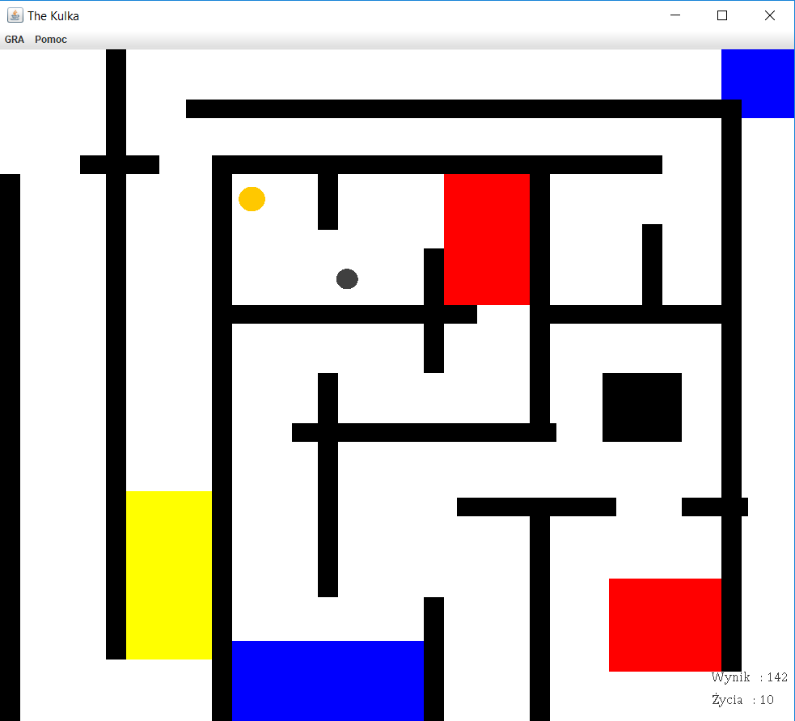

# KULKA-BlueRedYellow
___

  - Instructions
  - Game demonstration

# Instructions
___
  - Use the arrows to control. 
  - The ball must reach the finish circle. 
  - Avoid black obstacles.

Additional obstacles:
Blue field -    increasing gravity

Yellow field -  reduction of gravity

Red field -     increasing the ball

# Game demonstration
___

